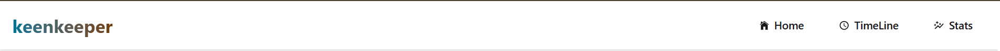
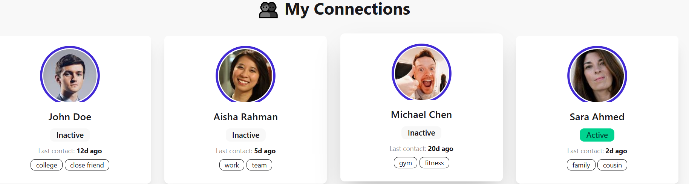
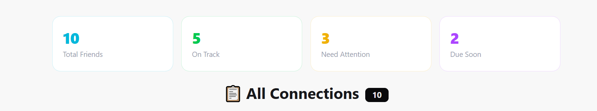
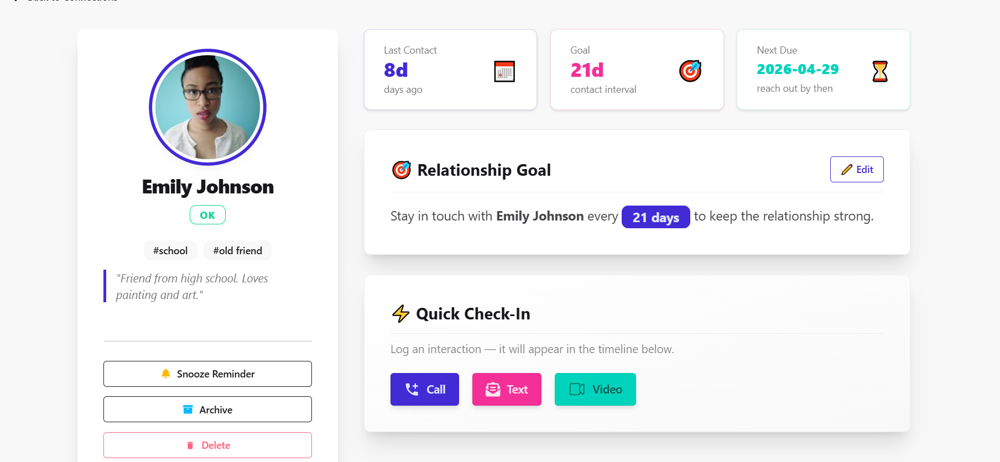
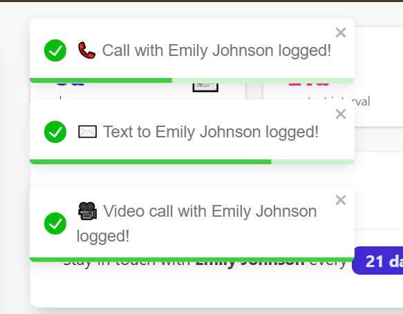
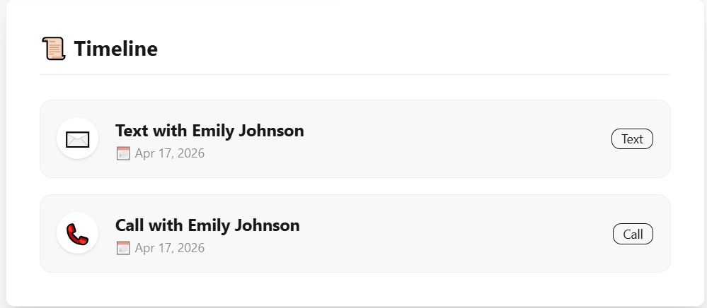
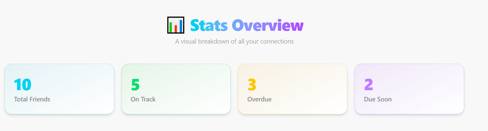
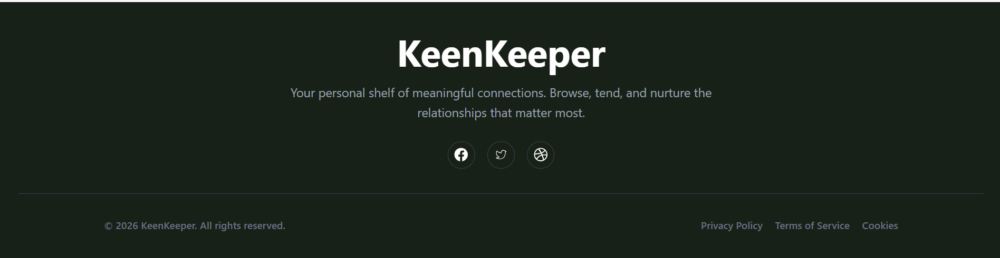

========Navbar========

==========heropart=====

=======connection part=====

======timeline part ========

=====card details ======

========added toastify======

=====timeline part ======

=======added graph chart ==

++++footer ++++++

=======about website =======
📌 Project Name

KeenKeeper

📝 Short Description

KeenKeeper is a fully responsive web application that helps you manage and maintain your personal relationships. It allows you to track your friends’ interaction history, view their activity status, and stay consistent with communication goals through an intuitive and visually engaging dashboard.

⚙️ Technologies Used
React
Tailwind CSS
DaisyUI
React Router
React Toastify
Recharts (for data visualization)

🚀 Key Features
Interactive Profile Cards & Modal View
Clicking on any friend card opens a detailed modal with complete information, including interaction history, goals, and status.
Dynamic Stats Dashboard
Visual insights using charts (bar & pie) to track communication habits, goals, and relationship status in a clear, engaging way.
Real-Time Toast Notifications
Smart toast alerts provide instant feedback for actions like updates, reminders, and interactions, improving user experience.
# React + Vite

This template provides a minimal setup to get React working in Vite with HMR and some ESLint rules.

Currently, two official plugins are available:

- [@vitejs/plugin-react](https://github.com/vitejs/vite-plugin-react/blob/main/packages/plugin-react) uses [Oxc](https://oxc.rs)
- [@vitejs/plugin-react-swc](https://github.com/vitejs/vite-plugin-react/blob/main/packages/plugin-react-swc) uses [SWC](https://swc.rs/)

## React Compiler

The React Compiler is not enabled on this template because of its impact on dev & build performances. To add it, see [this documentation](https://react.dev/learn/react-compiler/installation).

## Expanding the ESLint configuration

If you are developing a production application, we recommend using TypeScript with type-aware lint rules enabled. Check out the [TS template](https://github.com/vitejs/vite/tree/main/packages/create-vite/template-react-ts) for information on how to integrate TypeScript and [`typescript-eslint`](https://typescript-eslint.io) in your project.
